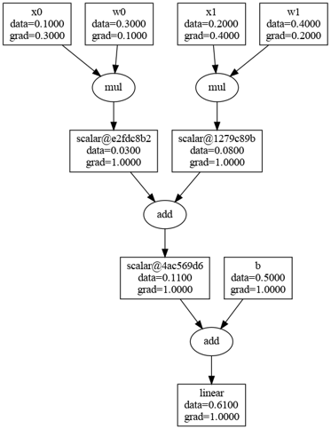

# scalargrad
`scalargrad` is a scalar autograd engine for training neural networks.  
It implements forward and backward passes over dynamic computional graphs of scalars in pure python.  

`scalargrad` is solely an educational project.  
It should not be considered as an autograd engine to actually train your networks with.    
It's just a playground to explore and better understand the machinery of backprogation for training neural networks.

This project is heavily inspired by [micrograd](https://github.com/karpathy/micrograd) by Andrej Karpathy.

# Quickstart
- __Linear function forward and backward passes__
```python
from scalargrad.scalar import Scalar

# define inputs and parameters.
x0 = Scalar(0.1, name='x0')
x1 = Scalar(0.2, name='x1')
w0 = Scalar(0.3, name='w0')
w1 = Scalar(0.4, name='w1')
b = Scalar(0.5, name='b')

# define linear function and execute forward pass.
f = (x0 * w0) + (x1 * w1) + b

# execute backward pass.
f.backward()

# display computational graph.
f.render()

# print result and gradients of weights.
print(f'forward: {f.data}')
print(f'df/dw0: {w0.grad}')
print(f'df/dw1: {w1.grad}')
```
Output:
```bash
forward: 0.61
df/dw0: 0.1
df/dw1: 0.2
```


- __Learning XOR with MLP classifier__
```python
from scalargrad.nn import Linear, Sequential, CrossEntropyLoss, SGD, Softmax

# define dataset.
x = [
    [1.0, 1.0],
    [0.0, 1.0],
    [1.0, 0.0],
    [0.0, 0.0],
]
y = [1, 0, 0, 1]

# define model, loss function and optimizer.
model = Sequential([
    Linear(2, 4, activation='relu'),
    Linear(4, 2, activation='identity'),
])
loss_fn = CrossEntropyLoss()
optim = SGD(model.parameters(), lr=0.075)

# train for 1000 epochs with batch size of 1.
for _ in range(1000):
    for xi, yi in zip(x, y):
        output = model(xi)
        target = yi
        optim.zero_grad()
        loss = loss_fn([output], [target])
        loss.backward()
        optim.step()

# predict softmax probabilities for each sample.
softmax = Softmax()
for xi, yi in zip(x, y):
    logits = model(xi)
    pred = softmax(logits)
    pred = [out.data for out in pred]
    print(f'x: {xi}')
    print(f'y: {yi}')
    print(f'pred: {pred}')
    print()
```
Output:
```
>>> x: [1.0, 1.0]
>>> y: 1
>>> pred: [0.0023424001473020847, 0.997657599852698]

>>> x: [0.0, 1.0]
>>> y: 0
>>> pred: [0.9966527803688605, 0.003347219631139429]

>>> x: [1.0, 0.0]
>>> y: 0
>>> pred: [0.9965988144771889, 0.003401185522811088]

>>> x: [0.0, 0.0]
>>> y: 1
>>> pred: [0.014056726645726948, 0.9859432733542731]
```
# Overview
`scalargrad` builds and executes computational graphs of scalars.  
In such graph each node is a scalar result of some mathematical operation.  
Each operation is recorded for forward and backward passes.  
Forward pass is executed on-the-fly as operations are called.  
Backward pass is executed by propagating backwards from arbitrary leaf node.  
Typically that node would be the value of your loss function.  

# Features
- Training neural networks
- Backprogation through arbitrary computational graph
- PyTorch-like API
- Pure Python3 implementation without any dependencies
- Tested against PyTorch (requires `torch` and `parameterized`)
- Computational graph visualization (requires `graphviz` and `pillow`)

# Modules
`scalargrad` implements common NN modules:
- `scalargrad.nn.Linear`: linear layer with activation function
- `scalargrad.nn.Sequential`: a sequence of layers
- `scalargrad.nn.Softmax`: softmax layer
- `scalargrad.nn.CrossEntropyLoss`: cross-entropy loss with softmax over raw logits
- `scalargrad.nn.MSELoss`: mean squared error loss 
- `scalargrad.nn.SGD`: stochastic gradient descent with momentum optimizer

# Training
Basic training and evaluation routines are provided via `scalargrad.train.Trainer` and `scalargrad.train.Evaluator`  
### Examples
- Training multiclass classification: `python -m examples.train_classification`
- Training scalar regression: `python -m examples.train_regression`

# Installation
Built with Python3.8.  
Core features such as executing forward and backward passes require no dependencies.  
However, testing and graph visualization do require some.  
Install them all via `requirements.txt` if needed.  
I also recommend installing CPU-only build of torch via `pip install torch --index-url https://download.pytorch.org/whl/cpu`.

# Testing
`scalargrad` forward and backward implementations are heavily tested against PyTorch.  
As a consequence `torch` and `parameterized` are required for testing.  

### Examples:
- Test core ops and NN modules (fast): `python -m unittest discover -v tests/core`
- Test training (very slow): `python -m unittest discover -v tests/train`
